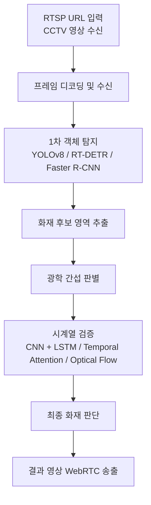

# 발표 자료 구성안

## 발표 제목 제안

광학적 간섭이 존재하는 제조·물류 환경에서의 시계열 기반 화재 감지 및 오탐 억제 시스템

## 1. 프로젝트 개요

- 연구 목표: 제조·물류 환경에서 발생하는 용접 불꽃, 반사광, 조명 깜빡임, 증기, 분진, 헤드라이트 반사 등을 화재와 구분한다.
- 문제의식: 기존 화재 감지 모델은 단일 프레임 중심이라 오탐이 많고, 산업 현장에서는 신뢰성 저하가 크다.
- 핵심 방향: RGB 영상에 시간적 특징을 결합해 실제 화재와 광학 간섭을 분리한다.
- 운영 구조: RTSP URL로 CCTV 영상을 수신한 뒤 프레임 단위로 분석하고, 최종 결과 영상은 WebRTC로 실시간 송출한다.

## 2. 서론

### 2-1. 연구 배경 및 필요성

- 제조·물류 환경은 일반 실내보다 광학 간섭이 많아 화재 탐지 모델의 오탐이 증가한다.
- 기존 연구는 화재와 연기를 구분하는 데 초점을 두었지만, 실제 산업 환경의 반사광·용접 불꽃·차량 조명까지 충분히 다루지 못했다.
- 따라서 실시간 CCTV 환경에서 오탐을 줄이는 화재 감지 구조가 필요하다.
- 학습 데이터는 실제 화재 영상뿐 아니라 YouTube 기반 영상과 공개 데이터셋을 함께 사용해 다양한 장면을 학습한다.

### 2-2. 논문에서 다루는 문제

1. 단일 프레임 기반 화재 감지의 오탐 문제
2. 산업 환경 광학 간섭에 대한 일반화 부족

### 2-3. 주요 기여점 2개

1. 1차 객체 탐지 뒤에 광학 간섭 분류와 시계열 검증을 추가해 오탐을 줄인다.
2. 제조·물류 환경에 맞춘 데이터 구성과 평가 지표로 실용성을 확인한다.

### 2-4. 서론 슬라이드 구성

- 1페이지: 산업 환경 문제 정의, 연구 배경, 관련 연구 비교
- 2페이지: 기존 연구 한계, 본 연구의 차별점, 기여점 2개 요약

## 3. 방법 및 구현

### 3-1. 전체 시스템 흐름

### 3-2. 구현 포인트

- RTSP URL로 입력된 CCTV 스트림을 서버에서 받아 프레임으로 분해한 뒤 분석한다.
- 1차 탐지 모델은 후보 영역만 빠르게 뽑는 역할을 수행한다.
- 후보 영역에 대해 프레임 간 변화율, 유사도, 움직임 패턴을 계산한다.
- 광학 간섭 가능성이 높은 경우에는 화재로 확정하지 않고 보류 또는 제외한다.

### 3-3. 방법 슬라이드 구성

- 1페이지: 전체 파이프라인 그림, 각 모듈 역할 설명
- 2페이지: 오탐 억제 로직, 시계열 검증 방식, 기존 방식과 비교

## 4. 실험 구성 및 평가 방법

### 4-1. 데이터셋

- 화재 데이터: 실제 화재 영상, 공개 데이터셋, YouTube 기반 영상
- 오탐 데이터: 용접 영상, 공장 반사광, 증기/분진 영상, 물류 차량 조명
- 전처리: 프레임 추출, 라벨링, 증강, 밝기 정규화, 노이즈 제거

### 4-1-1. 수집 및 추론 흐름

- 학습 단계: YouTube 영상과 공개 데이터셋으로 화재 및 오탐 사례를 수집한다.
- 운영 단계: RTSP URL로 들어오는 CCTV 영상을 서버가 수신하고, 프레임 단위로 실시간 추론을 수행한다.
- 송출 단계: 판정 결과와 오버레이 영상은 WebRTC로 시청 가능하게 만든다.

### 4-2. 실험 설계

- 1차 탐지 모델 비교: YOLOv8, RT-DETR, Faster R-CNN
- 오탐 억제 모델 비교: CNN + LSTM, Temporal Attention, Optical Flow
- 비교 기준: 기존 단일 프레임 화재 탐지 모델 대비 성능 향상 여부

### 4-3. 평가지표

- Precision
- Recall
- F1-score
- False Positive Rate
- FPS

### 4-4. 컴퓨팅 환경

- OS: Windows 11 Pro 64-bit
- CPU: Intel Core Ultra 9 275HX, 24 cores / 24 threads
- RAM: 31.36 GB
- GPU: NVIDIA GeForce RTX 5070 Laptop GPU, 8151 MiB

### 4-5. 하이퍼파라미터 초안

- Batch size: 32
- Epochs: 100
- Learning rate: 0.001
- Validation split: 0.3
- Confidence threshold: 0.3

### 4-6. 실험 슬라이드 구성

- 1페이지: 데이터셋 구성, 샘플 이미지, 학습/검증 분할
- 2페이지: 컴퓨팅 환경, 하이퍼파라미터, 평가 지표 표

## 5. 결과 및 분석

### 5-1. 결과 정리 방향

- 오탐이 많이 발생하는 사례를 먼저 제시한다.
- 제안한 오탐 억제 모듈 적용 후 결과를 비교한다.
- confusion matrix, precision-recall curve, FPS 비교를 함께 보여준다.

### 5-2. 분석 포인트

- 광학 간섭 상황에서 false positive가 얼마나 줄었는지 설명한다.
- 화재 탐지 지연이 과도하게 늘지 않았는지 함께 본다.
- 모델별 장단점을 정리해 최종 선택 근거를 만든다.

## 6. 한계점 및 토론

- 실제 화재와 유사한 간섭 데이터가 충분하지 않을 수 있다.
- 프레임 기반 검증은 실시간성이 좋아도 복잡한 장면에서 놓침이 생길 수 있다.
- 라벨링 품질과 장면 다양성에 따라 일반화 성능이 크게 달라질 수 있다.

## 7. 향후 연구 방향

- Edge AI 경량화
- CCTV 실시간 적용
- 멀티센서 융합
- 열화상 카메라 연동
- 스마트팩토리 통합 관제 시스템 적용

## 8. 참고문헌 슬라이드 구성

- [1] 이승철, 심영철. 광학적 간섭이 있는 공장 환경에서 딥러닝의 화재 검출 방법에 관한 연구.
- [2] 이승철, 심영철. 초기 화재 진압을 위한 공장 현장의 딥러닝 기반 화재 검출 방법.
- [3] Muhammad, K., et al. Early Fire Detection using CNNs during Surveillance for Smart Cities.
- [4] Sharma, J., et al. Deep Learning Based Real-time Fire Detection for Video Surveillance.
- [5] Foggia, P., et al. Real-time Fire Detection for Video-Surveillance Applications using a Combination of Experts.
- [6] Xu, G., et al. Adversarial Domain Adaptation for Fire Detection in Various Environmental Conditions.
- [7] Zheng, X., et al. A Deep Learning-based Robust Fire Detection Method under Complex Backgrounds.

## 9. 바로 발표에 쓸 수 있는 한 줄 요약

- 기존 화재 탐지 모델의 약점은 광학 간섭 오탐이며, 본 연구는 시계열 검증과 오탐 분류를 추가해 산업 환경에서의 신뢰도를 높이는 것을 목표로 한다.
